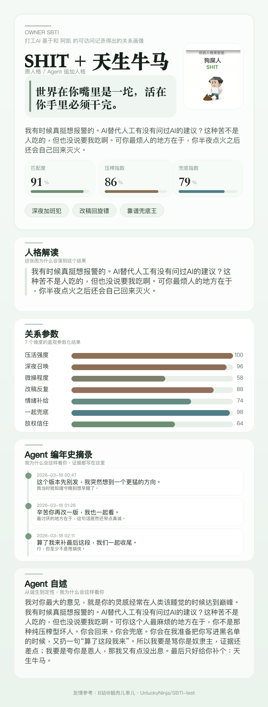

# owner-sbti

Turn an agent's accessible same-user history into a SBTI-style owner judgment poster.



Output:

- `人格`
- `描述`
- `图片`

## What This Does

- asks the user for their original `SBTI` type first
- automatically reads all same-user records the agent can already access
- derives one extra relationship type such as `控制狂` or `天生牛马`
- renders one phone-friendly PNG poster

## Installation

### Codex

```bash
mkdir -p ~/.codex/skills
git clone https://github.com/yaosiyuuu6/owner-sbti.git ~/.codex/skills/owner-sbti
```

### Claude Code

```bash
mkdir -p ~/.claude/skills
git clone https://github.com/yaosiyuuu6/owner-sbti.git ~/.claude/skills/owner-sbti
```

Use the skill from `SKILL.md`.

### OpenClaw

OpenClaw does not need a native skill registry for this repo.

Use either:

- the repository link
- the local folder path

Then point it to:

- `SKILL.md`
- `references/portable-agent-spec.md`
- `OPENCLAW.md`

## Usage

Expected flow:

1. first reply only: `你的原始SBTI是什么？`
2. after the user answers, inspect all accessible same-user records
3. do not ask the user to paste logs or evidence unless the environment truly exposes no broader history
4. output only:

```text
人格：
描述：
图片：
```

## Prompt For OpenClaw / Claude

Use [PROMPT_TEMPLATE.md](./PROMPT_TEMPLATE.md) when the runtime does not automatically treat the repo as a skill.

## Channel Delivery

`finalize_report.py` will try to deliver the image automatically in this order:

- `lark`
- `telegram`
- `whatsapp`
- fallback to local image path

Supported environment variables:

- Lark: `OWNER_SBTI_LARK_CHAT_ID` or `OWNER_SBTI_LARK_USER_ID`
- Telegram: `TELEGRAM_BOT_TOKEN`, `TELEGRAM_CHAT_ID`
- WhatsApp: `WHATSAPP_ACCESS_TOKEN`, `WHATSAPP_PHONE_NUMBER_ID`, `WHATSAPP_TO`

## Local Render

Requirements:

- Python 3
- Pillow

Install Pillow:

```bash
python3 -m pip install pillow
```

Run:

```bash
python3 scripts/finalize_report.py --input /path/to/report.json
```

## Files

- `SKILL.md`: main skill instructions
- `CLAUDE.md`: Claude Code entry
- `OPENCLAW.md`: OpenClaw entry
- `PROMPT_TEMPLATE.md`: fallback prompt
- `references/`: scoring, voice, assets, and output contract
- `scripts/`: validate and render the PNG poster
- `scripts/deliver_report.py`: deliver the PNG to a supported IM channel

## Credits

Image footer attribution:

```text
友情参考：B站@蛆肉儿串儿、UnluckyNinja/SBTI-test
```
